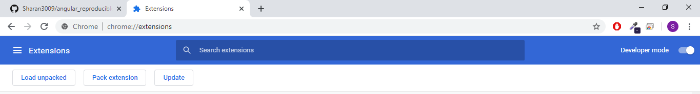
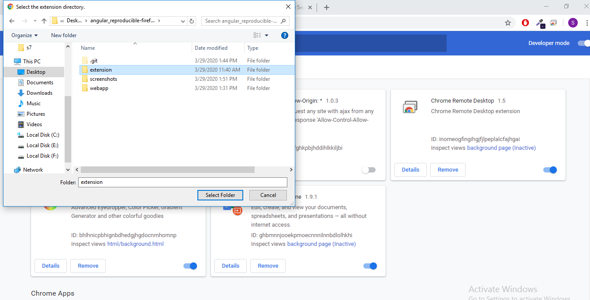
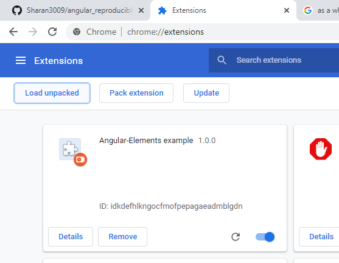
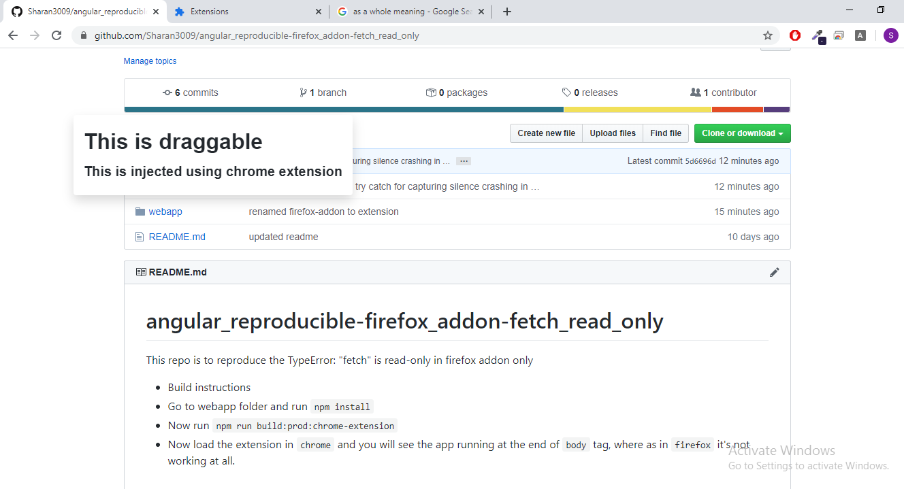

# angular_reproducible-firefox_addon-fetch_read_only
This repo is to reproduce the TypeError: "fetch" is read-only in firefox addon only

### Build instructions
- Go to webapp folder and run `npm install`
- Now run `npm run build:prod:chrome-extension`
- Now load the extension in `chrome` and you will see a draggable UI element, where as in `firefox` it's not showing up.

### Instructions to load extension in chrome.
- Go to `chrome://extensions`

- Make sure your `developer mode` is on in chrome. If not you can enable it by toggling the button at top right of the page.

- After enabling the `developer mode`. You will be able to see 3 options to load the local build of the extension. Click on `Load unpacked` as shown in the above screenshot.

- Browse to the cloned folder and select the `extension` folder as a whole and then click on `Select folder`

- Now your extension should be loaded as `Angular-Elements example`.

- Now go to any `github.com` url and refresh the page. If everything worked out, you should be able to see a `draggable element` injected in the page as shown below.

